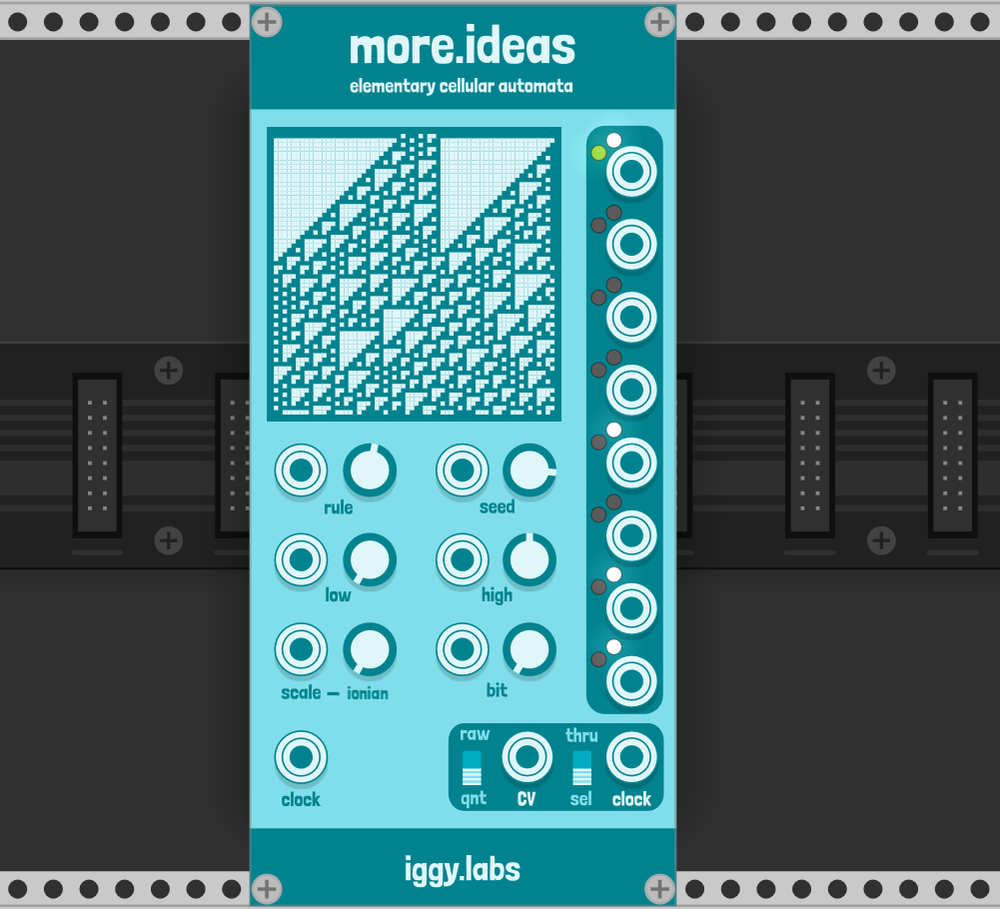
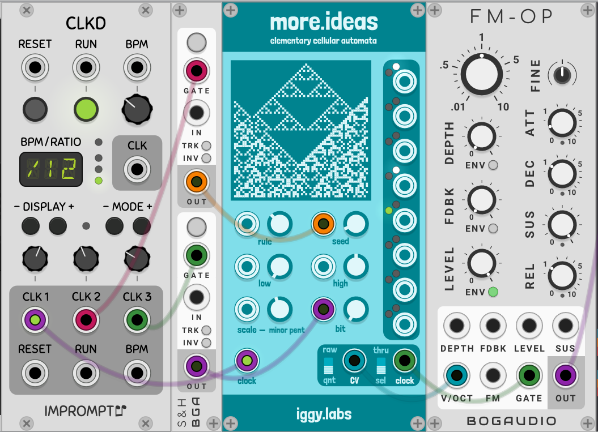

# more.ideas

## Intro
*more.ideas* is an elementary cellular automata sequencer. It provides:
* 1 main clock output
* 8 auxiliary clock outputs
* 1 CV output with optional quantization

## Origins
*more.ideas* is based on the *less_concepts* script by Dan Derks which is available as a monome norns script and a Max4Live device. In turn, *less_concepts* was inspired by a script by Ezra Buchla for the monome teletype module. You can read about *less_concepts* a few places on the internet:
* [Less concepts for norns thread on lines](https://llllllll.co/t/less-concepts/21109)
* [Less concepts for Max4Live on Cycling '74](https://cycling74.com/tutorials/algorithms-less-concepts-max-for-live-device-cellular-automata)
* [less_concepts on GitHub](https://github.com/dndrks/less_concepts)

## What more.ideas does

To understand *more.ideas*, you should first understand 1D (elementary) cellular automata. The Wolfram MathWorld [page](https://mathworld.wolfram.com/images/eps-gif/ElementaryCA_850.gif) is a good place to start.

### Rules, seeds, and bits

For *more.ideas*, the first generation of cells is created from the seed value from the range 0-255. On the display, it is the center 8 pixels on the top row.

Given another integer from 0-255, the automaton has a rule for evolution. On every input clock trigger/gate, the automaton creates a new generation. The new generation is itself a number from 0-255, displayed as 8 bits. These are the white lights for each of the 8 auxiliary clock outputs. (These clock outputs will take the same shape as the input clock whether it is a gate or trigger; the pulse width does not matter and the input simply passes through if the respective bit is on.)

The display shows how the automaton will evolve over time. It is a preview into the life of the seed and its rule, if you will, while the white lights show the evolution in real time.

Turning the bit parameter will change which bit is used for CV out and main trigger out calculations. More on this later.

### To quantize or not to quantize: low, high, scale, and the "raw" switch.

To calculate the output CV, *more.ideas* uses the fractional value of the current generation (so some number from 0-255 divided by 255) and maps it to a range.

When in quantize ("qnt") mode, this means finding the closes note in the provided scale that is the fractional distance between the low and high parameters. (Note that low and high are suggested terms; you can have low be higher than high and still generate a valid range.) So if your current generation is 0, you will get out the lowest possible note in the range. (For reference, the note "0" is mapped to C3 to follow the precedent of the original *less_concepts* script.)

When not in quantize mode (called "raw" mode), the fractional value is mapped to the range selected in the right click menu. This also means that the low, high, and scale parameters have no effect on the output CV.

### Main output clock

There are two modes for the output clock:
1. thru: the output simply passes through the input clock
2. sel: pulse outputs on any change of output CV value

## A first patch

Here is an idea for a first patch with *more_ideas*! Using a sample and hold from a divided clock to modulate the seed and selected bit will add some controlled randomness to your chosen rule.

## FAQ

### Why isn't there anything coming out of the triggers or clock output even though the clock input is connected? 

It is possible you've chosen a seed or rule combination that results in a blank/empty set in which case you'll get no output. The canonical example would be anything with rule or seed 0. 
