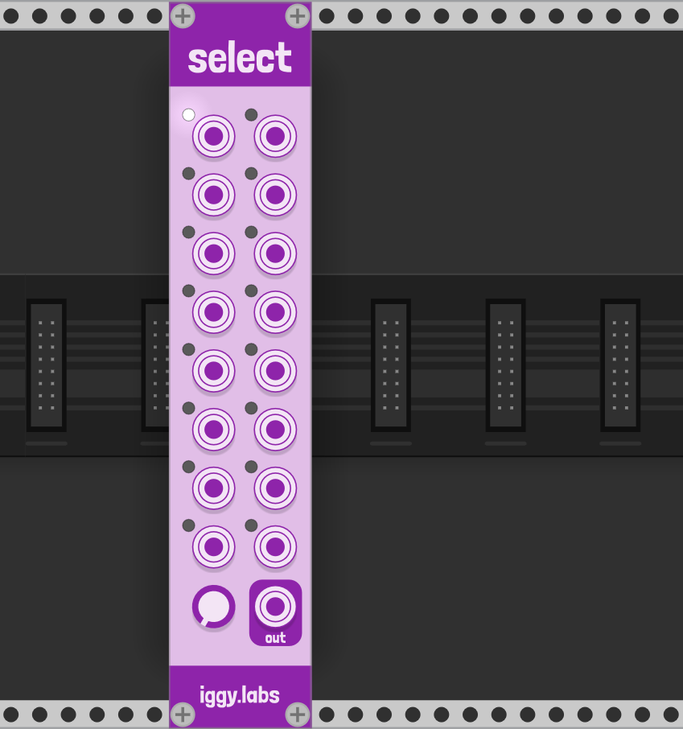

# Select

## Intro
Select is an input selector utility. Sixteen inputs (each input supports 16 channels of polyphony) can be patched in, and the dial selector sets which input to send through to the output. A light next to the port will turn on if it is the currently selected input.

## Suggestions

- Try using the [Stoermelder uMap](https://github.com/stoermelder/vcvrack-packone/blob/v1/docs/CVMapMicro.md) to modulate the selector knob
- Sending clock triggers into different inputs and switching between them can be an effective way of creating interesting rhythms