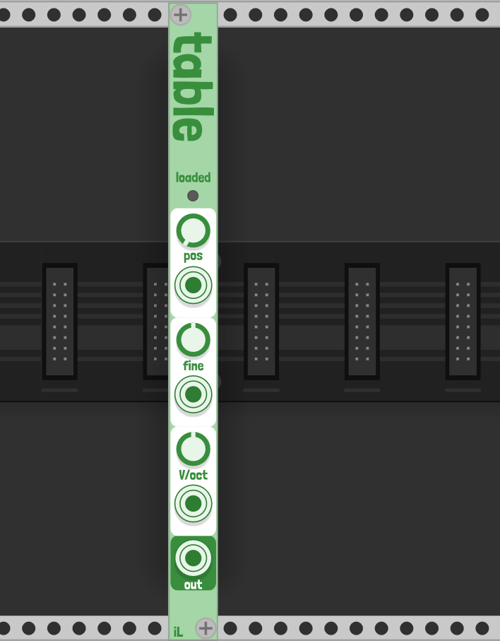

# Table

[YouTube demo](https://www.youtube.com/watch?v=gjz9PFwesQk)

## Intro
Table is a wavetable oscillator for user-provided wavetables like those you might import into a VST wavetable synthesizer. It supports 16 channels of polyphony.

## How to use
Table is small and intended to be easy to understand.

If no user wavetable is loaded, the default output is a saw wave. To import a wavetable, right click on the module, select your samples/cycle for your wavetable, and select the appropriate .wav file. The module's light will turn on to let you know your sample is loaded.

The three parameters:
1. pos: The position in the wavetable
2. fine: Fine frequency tuning
3. V/oct: Coarse, semitone frequency tuning

## Suggested resources
- [WaveEdit](https://synthtech.com/waveedit) by Synthesis Technology is a _free_, open-source wavetable editor for PC/Mac/Linux which outputs 256 sample/cycle wavetables. Bonus: it was created by Andrew Belt, developer of VCV Rack 😃 
- Elektronauts user Taro's [collection](https://www.elektronauts.com/t/free-wavetables/121639)
- [osc_gen](https://github.com/harveyormston/osc_gen) Python package to generate wavetables of any length you choose
- If you own Xfer Serum, the wavetable editor can export wavetables (2048 samples/cycle)
- [Blamsoft](https://blamsoft.com/tutorials/expanse-creating-wavetables/) tutorial on creating wavetables
- Google around for free wavetables!

## Determining cycle length
In order to import a wavetable, you will have to select the length of a single cycle so Table knows how to split up the consolidated wave file properly. Unfortunately there is no standard cycle length, but here are some options.
1. Sometimes the creator of the wavetable will let you know. For example, the Taro collection (see above) names their samples with a suffix of [256, 512, 1024, 2048]. 
2. You can also try importing into WaveEdit which splits up the sample for you into 256-sample cycles. From that visual you may be able to guess the sample length.
3. Try out the different options to see what sounds best!

---
## Developer notes
In order to reduce aliasing, Table creates multiple copies of each cycle and bandlimits them in intervals of octaves. Adjusting the pitch up on the oscillator allows the module to select the appropriately bandlimited wavetable to maximize the number of harmonics while avoiding audible aliasing. Thank you to Nigel Redmon for the [series](https://www.earlevel.com/main/2020/01/04/further-thoughts-on-wave-table-oscillators/) on EarLevel Engineering which helped in implementing this technique.

Improvements on CPU usage have been adapted from the Squinky Labs [Demo](https://github.com/squinkylabs/Demo) VCO2.